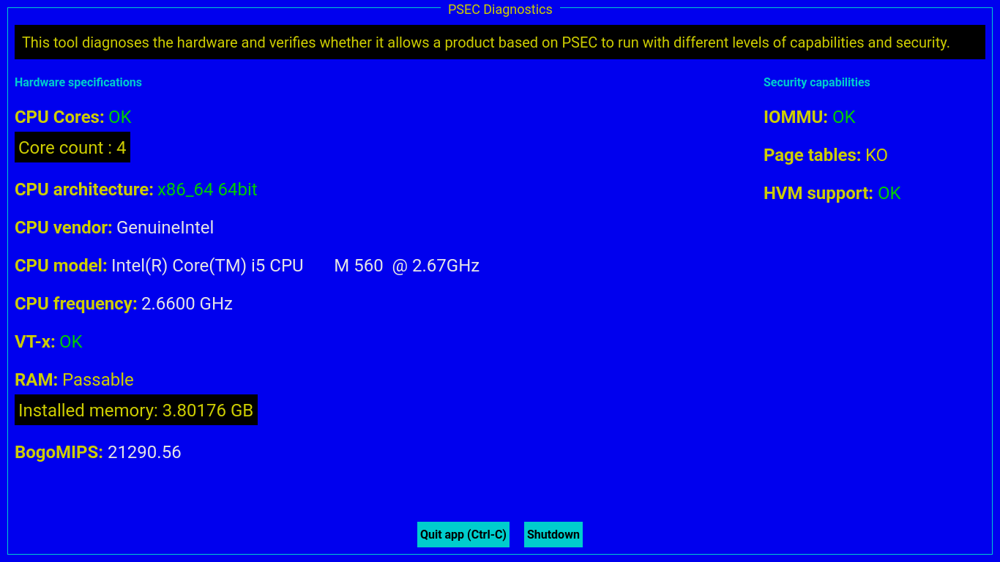

# Safecor Diag

Safecor Diagnostic tool is a simple way of veryfing that a platform can run a product based on Safecor and evaluate the level of security offered.

You can create an USB disk and use it on multiple platforms to verify their capacity.

> ⚠️ **Notice**
>
> The platform virtualization and security capabilities depend on the settings of the BIOS or EFI. Please adapt the settings to enable VT-d/AMD-Vi (or IOMMU) and VT-x/AMD-V.

## Screenshot

## Create an USB disk (x86 only)

- Download the image file [safecor-diag-latest-x86.7z](https://www.alefbet.net/images/safecor-diag-latest-x86.7z).
- Format the USB disk in FAT32 with MBR (Master boot record) or bootable option.
- Uncompress the archive file.
- Copy all the files from the archive to the USB disk.