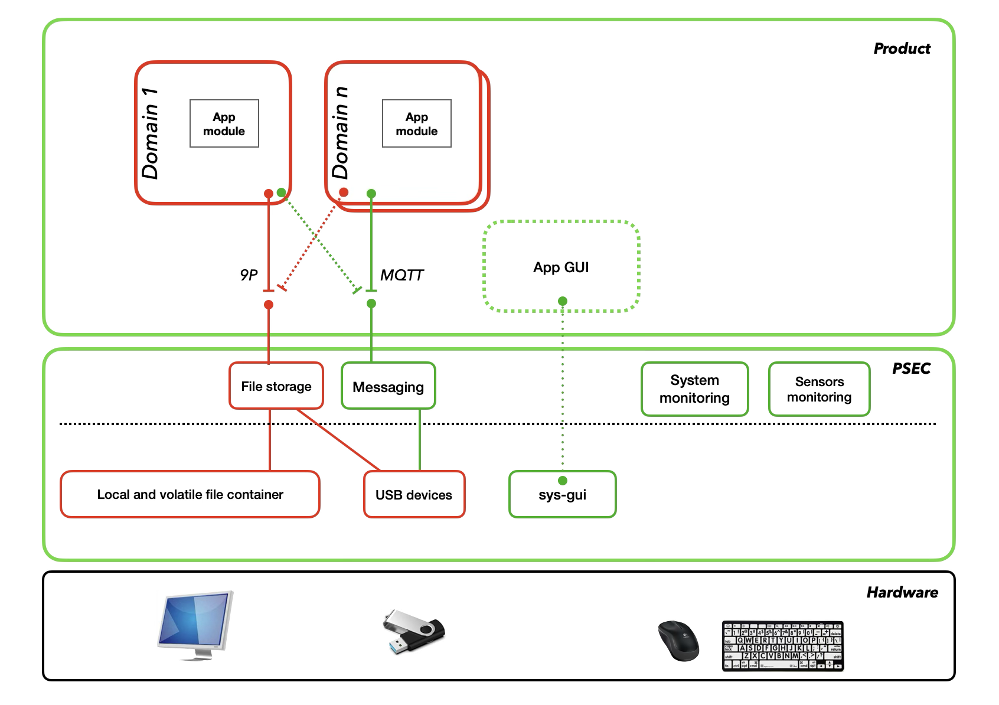
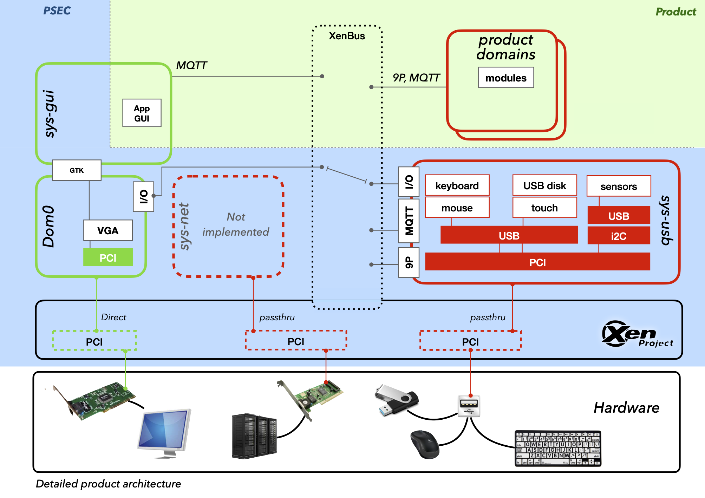

# Product architecture

This document describes the architecture of the security-oriented technical platform.

## Overview of the product architecture

A product is composed of one ore more domains with their own application module. The modules should be designed according to their level of trust. All modules using external data (communicating with USB drives or the network for example) should be considered as not trustable and should be separated from modules which only manipulate commands and user interfaces.

The user interface graphical application (GUI) is hosted in the `sys-gui` Domain which has a high level of trust.

## Detailed architecture

In the `sys-gui` domain, the graphical user interface application has access to an X server whose display is rendered on a virtual graphics card provided by `QEMU` in the Dom0. The display of `QEMU` is then made in a GTK borderless window in an X server running on the real graphics card.

The integration of the product GUI is made with the section `gui.app-package` of the [topology.json](topology.md) file.

## Virtual Machines (Domains)

The platform includes the following virtual machines:

| Name | Description | Trust Level |
|---|---|---|
| Dom0 | Domain 0 is a special virtual machine used to manage user domains and interface with the XenBus. | High |
| sys-gui | This domain displays the product graphical interface. | High |
| sys-usb | This user domain is responsible for managing USB devices (keyboard, mouse, storage devices) and isolating them from the rest of the system. | Low |

### Dom0

This section provides technical details about `Domain 0`.

Installed packages:
- python (`psec-core`)

### sys-usb

This section provides technical details about the core domain `sys-usb`.

The `sys-usb` domain provides the following functions via a special data channel:
- keyboard input
- mouse position
- mouse button states
- touch position
- reading the file catalog from a USB device
- reading a file from a USB device
- writing a file to a USB device

### sys-gui

This section provides technical details about the core domain `sys-gui`.

### sys-net

This section provides technical details about the core domain `sys-net`.

*This Domain is currently not available.*